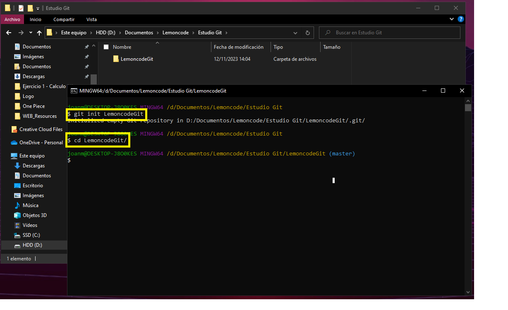
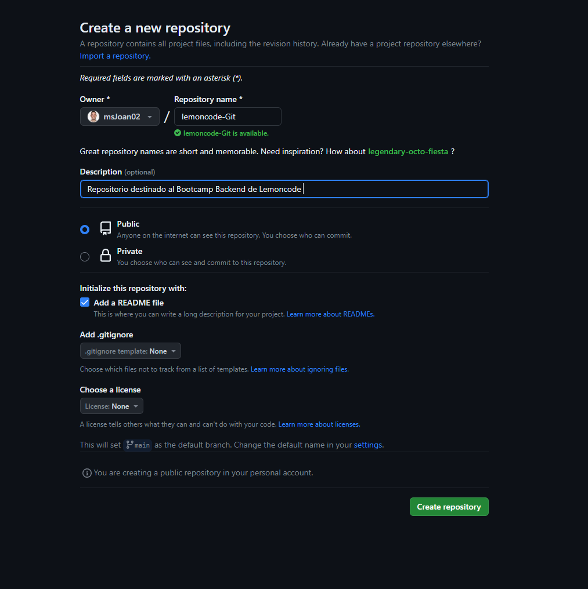
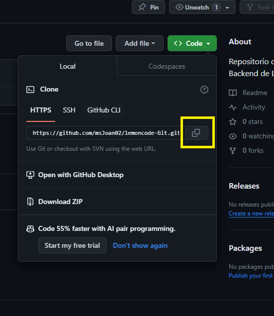
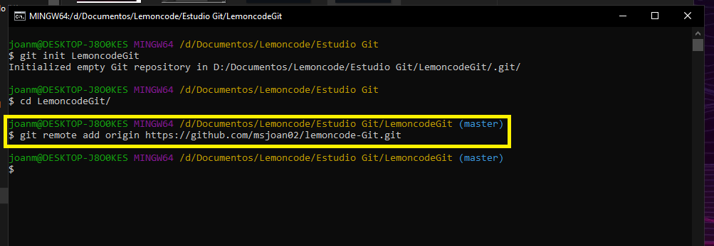
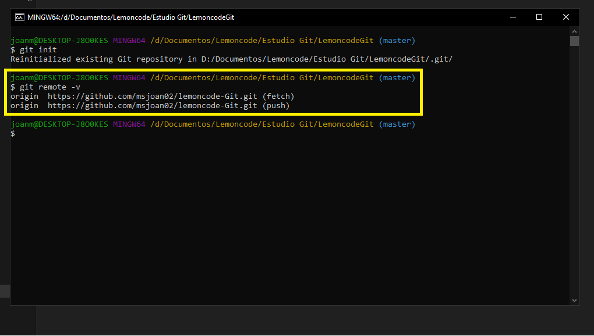
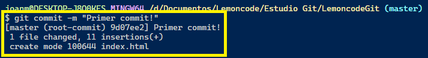
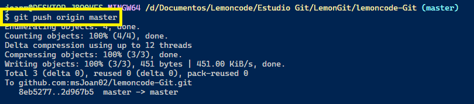
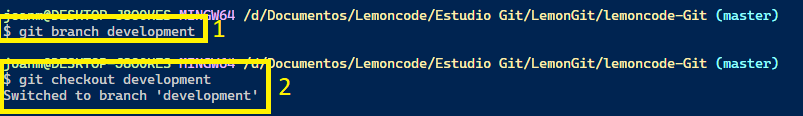
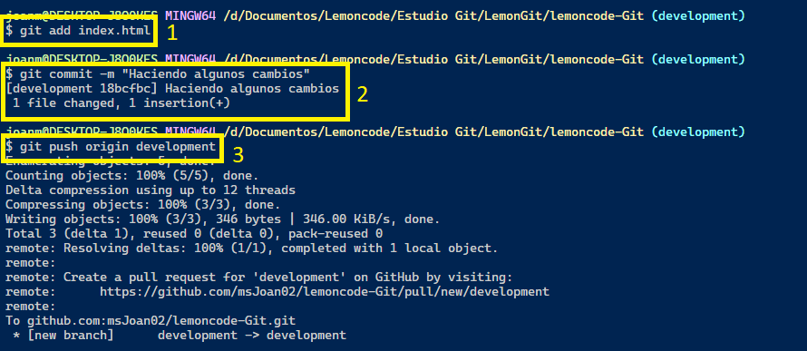
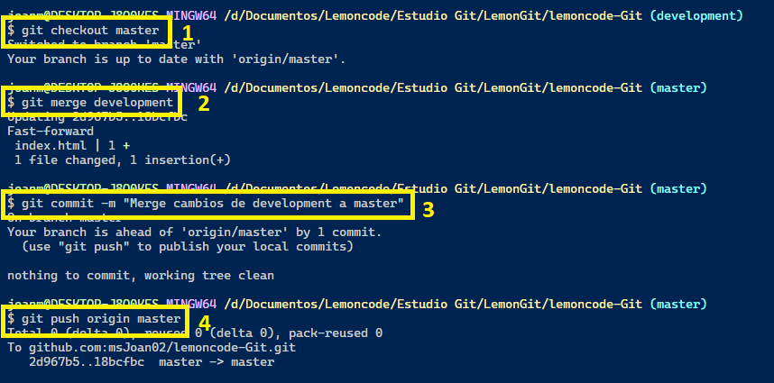

# Laboratorio de Git

En este documento se detallan los primeros pasos a la hora de trabajar con repositorios de Git y repositorios en línea como Github.

_15 de Noviembre de 2023_

## Objetivos
**1. Crear un repositorio local**

- Inciamos un Git Bash en la ruta donde queremos crear el repositorio, inicializamos y nos introducimos en el.

---
**2. Creamos el repositorio remoto (GitHub)**
- En GitHub creamos un repositorio.

- Copiamos el enlace del mismo. En este caso se ha utilizado SSH.

---
**3. Subiendo archivos y staging**

- Creamos un archivo
- Añadimos ruta remota de nuestro repositorio GitHub

- Añadimos archivo al _staging_

- Ejecutamos _commit_ con mensaje.

- Subimos cambios con _push_

---
**4. Jugando con las ramas**
1. Creamos rama _development_ y nos movemos a ella

2. Hacemos cambios en ___index.html___ y los subimos a la nueva rama

---
**5. Fusionando cambios**

1. Volvemos a la rama **master**.
2. Ejecutamos _merge_ de **development** a **master**.
3. _Commit_ para subir cambios a repositorio local.
4. _Push_ con los cambios a remoto.
---

---